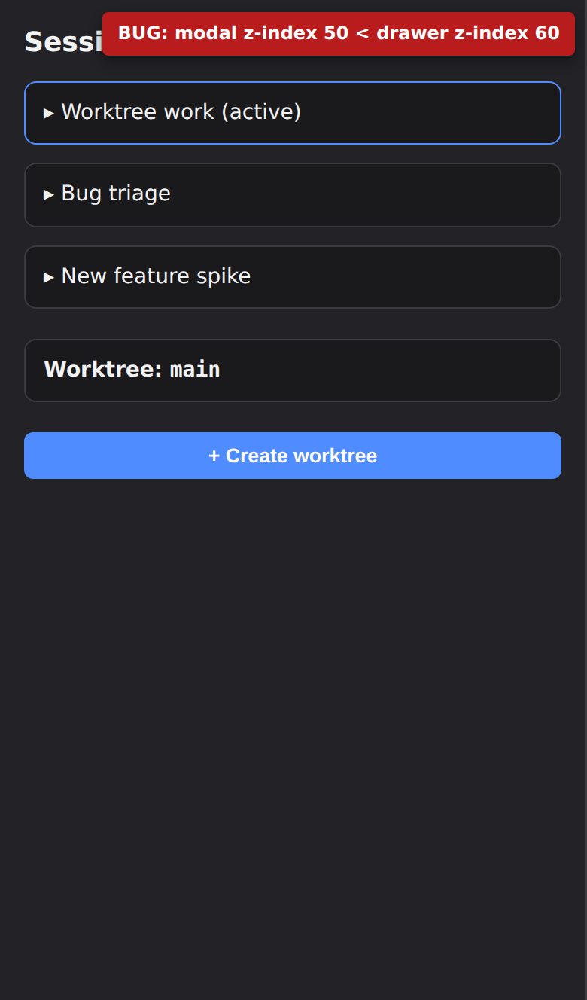
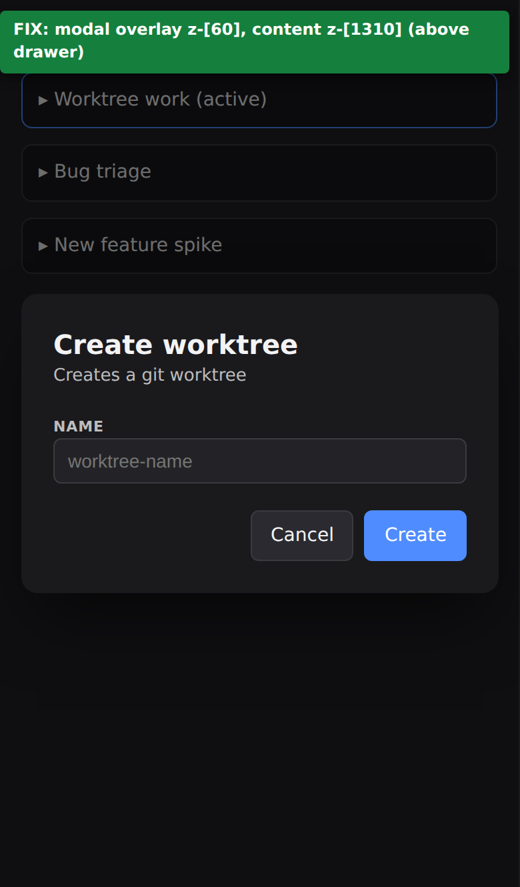
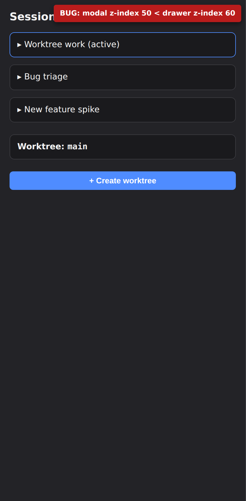
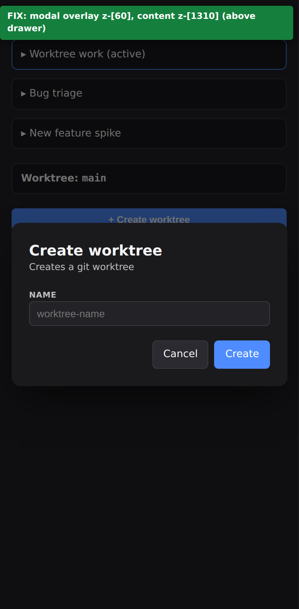

# Repro: worktree modal hidden behind mobile session drawer (PR #463)

Minimal isolated repro of the z-index conflict described in
[NeuralNomadsAI/CodeNomad PR #463](https://github.com/NeuralNomadsAI/CodeNomad/pull/463).

## What the repro mirrors from `origin/dev`

- **Session sidebar drawer**, `packages/ui/src/components/instance/instance-shell2.tsx`
  lines 649–656:
  - MUI `<Drawer variant="temporary">` with `sx={{ zIndex: 60, "& .MuiDrawer-paper": { width: isPhoneLayout() ? "100vw" : ... } }}`.

- **Worktree create dialog**, `packages/ui/src/components/worktree-selector.tsx`
  lines 425–426 (and similarly lines 497–498 for the delete dialog):
  - `<Dialog.Overlay class="modal-overlay" />` where `.modal-overlay` is
    `fixed inset-0 z-50` with `background-color: var(--overlay-scrim)`.
  - `<div class="fixed inset-0 z-50 flex items-center justify-center p-4">`.

Because the modal's `z-50` is lower than the drawer's `zIndex: 60`, and the
drawer occupies the full 100vw on phone layouts, the modal renders behind
the drawer and is invisible/uninteractive on mobile.

## Files

- [`bug.html`](./bug.html) — exact stacking from `origin/dev` (HEAD `6817558` at time of writing).
- [`fix.html`](./fix.html) — same markup with the two utility z-index classes raised: overlay `z-[60]`, content wrapper `z-[1310]` (same pattern used by `alert-dialog.tsx` lines 117–119).

## Screenshots (Playwright, 2x DPR)

### iPhone 13 viewport (390x844 logical)

| Bug (`origin/dev`) | Fix (PR #463) |
| :---: | :---: |
|  |  |

### Pixel 7 viewport (412x915 logical)

| Bug (`origin/dev`) | Fix (PR #463) |
| :---: | :---: |
|  |  |

## Pixel-level confirmation

Center-screen pixel sampling (via sharp) on the iPhone 13 captures:

- `bug-iphone13.png` center pixel → `rgb(35, 35, 39)` = the drawer paper color (`--surface-secondary`). The drawer is covering the entire viewport.
- `fix-iphone13.png` over the modal surface area → `rgb(26, 26, 29)` = the modal surface color (`--surface-base`). The modal is rendering on top of the drawer.

## How the screenshots were generated

```bash
# Playwright headless Chromium against the two static HTML files,
# at iPhone 13 and Pixel 7 viewports with deviceScaleFactor: 2.
node shoot.cjs
```

No CodeNomad app runtime is required — the repro pages are self-contained
and use vanilla HTML + CSS that mirror the exact stacking from the real code.
